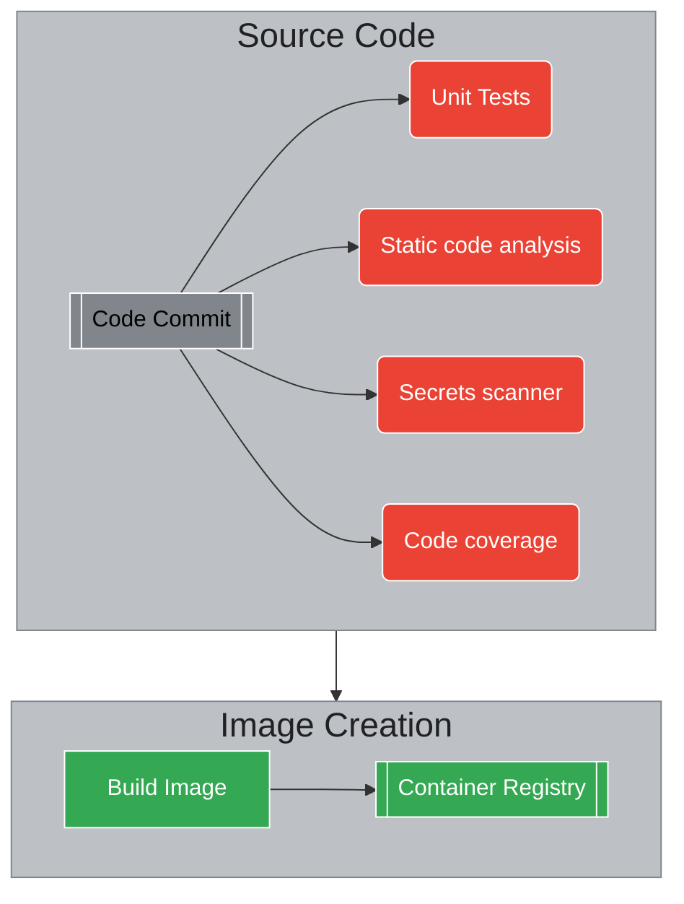
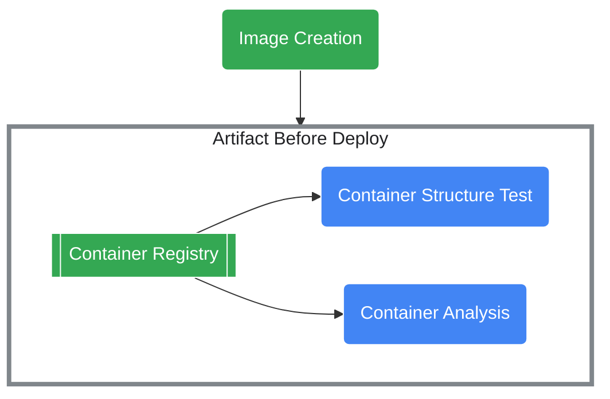
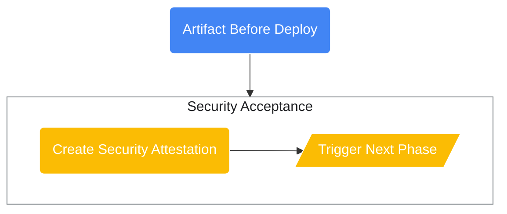

# Overview

This is an opinionated repository demonstrating Cloud Build based builds of Bank-of-Anthos main-line along with secure CI/CD principles applied.

This demonstration uses Bank of Anthos to simulate a company building and deploying services to a multi-tier kubernetes cluster using asynchronous GitOps.

# Table of Contents
1. [Requirements](#requirements)
1. [Run the demo](#run-the-demo)
1. [Clean up](#cleaning-up)

# Requirements

## Required Repositories
The solution uses two Git repositories and will need to fork a copy of each.

1. This repository that pulls in a copy of main-line Bank of Anthos. (__Fork this repository__)
    * [How to Fork Repos with GitHub](https://docs.github.com/en/github/getting-started-with-github/fork-a-repo)
    * [How to Fork Repos with GitLab](https://docs.gitlab.com/ee////user/project/repository/forking_workflow.html#creating-a-fork)
1. Desired state used by Config Sync manager inside each cluster. Fork (#TODO-create a repo)

## Environment Variables
| Name  |  Example | Description  |
|:----:|:---:|:----|
| PROJECT_ID | gcp-example-project-id  | Google Cloud Project ID name |

## Command Line Tools
| Name  |  Description | Link/Install  |
|:----:|:---:|:----|
| gcloud | Interact with GCP APIs from the command line | [install link](https://cloud.google.com/sdk/docs/install) |
| gsutil | Interact with Google Cloud Storage buckets | $> `gcloud components install gsutil` |

# Run the Demo

This is a diagram of the entire CI/CD flow with labeled stages. Each subsection (labeled as "phases") will target one or more of the subsections.

```mermaid
flowchart LR
    A(Code Commit)
    B1(Unit Tests)
    B2(Static code analysis)
    B3(Secrets scanner)
    B4(Code coverage)
    C(Build Image)
    D2(Container Structure Test)
    D3(Container Analysis)
    CR[[Container Registry]]
    PCR[[Container Registry]] %% This needs to be the same as CR
    subgraph CI [Continuous Integration Phase]

        subgraph source [Source Code]
            A --> B1:::stage1
            A --> B2:::stage1
            A --> B3:::stage1
            A --> B4:::stage1
        end
        subgraph build [Image Creation]
            C:::stage2 --> PCR:::stage2
        end
        subgraph before [Artifact Before Deploy]
            CR:::stage3 --> D2:::stage3
            CR --> D3:::stage3
        end
        subgraph attestation [Security Acceptance]
            SA(Create Security Attestation):::stage4 --> T[/Trigger Next Phase/]:::stage4
        end

        source:::subg --> build
        build:::subg --> before
        before:::subg --> attestation
        %%attestation:::subg --> DONE((Done))
    end

    S((start)):::stage0 --> source

    %% Apply a "Google" theme for fun
    classDef subg stroke:#000,stroke-width:4px,fill:#fff,color:#000,font-size:normal
    classDef stage0 stroke:#fff,fill:#fff,color:#000
    classDef stage1 stroke:#fff,fill:#EA4335,color:#fff
    classDef stage2 stroke:#fff,fill:#34A853,color:#fff
    classDef stage3 stroke:#fff,fill:#4285F4,color:#fff
    classDef stage4 stroke:#fff,fill:#FBBC04,color:#fff
    classDef bg fill:#BDC1C6,stroke:#80868B,font-size:x-large,color:#202124
    %% Nodes that are not referenced in a directional connection
    class A stage1
    class attestation subg
    class CI bg; %% connect subgraph CI
```

## 1. Source Code
This first stage will build all candidate artifacts (docker-based images).


### Steps
* Unit tests - Run unit tests for all source code
* Static code analysis (PMD, Checkstyle, Linting) - Run static analysis for all source code
* Secrets scanner - Look for secrets embedded in source
* Code coverage - Pull code coverage numbers and make decision based on results

### Goals
* Fail fast if any of the steps fail
* Validate source code for artifact build

> NOTE: The conclusion of this stage will have all docker images created in the GCR related to the [**PROJECT_ID**](#environment-variables). Additionally, an attestation will be created

### Hands-On

1. Fork this repo
1. Create & satisfy **[Environment Variables](#environment-variables)** and **[Command Line Tools](#command-line-tools)**
1. Run `one-time-setup.sh`
    ```bash
    ./one-time-setup.sh
    ```

## 2. Artifact before deployment
This next stage is to verify the artifact before it has been deployed


### Steps
* Container Structure Tests - Verify that the container built conforms to the organizational standards
* Container Analysis - Verify that the container does not contain Common Vulnerabilities or Exposures (CVEs) per the organization's standards

### Goals
* Fail fast if any of the steps fail
* Validate the artifact build to be ready for lower-level environments
* Artifact passes basic organization policy regulations

### Hands-On

1. Add steps to `cloudbuild.yaml`
1. TBD (figuring out how to make this a step-by-step)<!-- TODO: DO THIS STEP>
1. Run pipeline
    ```bash
    gcloud builds submit
    ```

## 3. Create Security Attestation
The final step in the `Continuous Integration` phase is to create an Attestation to attest to the fact that the container has successfully completed the previous steps.


### Steps
* Create Attestation - The only step in this phase is to create an attestation for the artifact. This requires the artifact's image-digest as well as access to the Actor/Signer for automated security.

### Goals
* Create an attestation using the Security attestor

### Hands-On

1. Add steps to `cloudbuild.yaml`
1. Run pipeline
    ```bash
    gcloud builds submit
    ```

# Cleaning Up

The `cleanup.sh` script is provided to clean up only this repository, but does NOT manage any GCP project infrastructure or state. The script's primary purpose is to reset this repository allowing the Cloud Build runs to be reset and re-run.